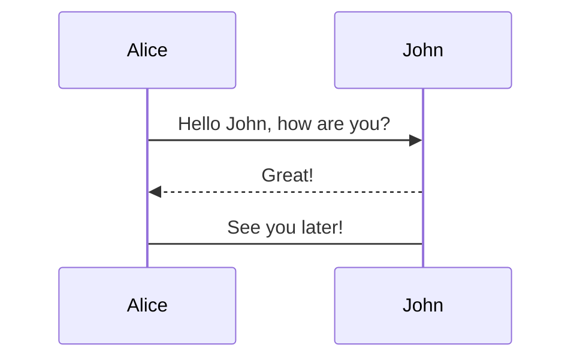

# Oppgaver: UML-modellering av Foosball Match Simulator

## Oppgave 1: Klassediagram i Miro eller draw.io

Dere skal bruke verktøyene draw.io eller Miro for å modellere.

Lag et klassediagram for systemet slik det er i dag.

**Tips til å komme igang:**

1. Ta med disse klassene:
   - `MatchEngine`
   - `Match`
   - `Team`
   - `Player`
   - `MatchEvent`

2. Bruk denne lenken for å se på forskjellig regler: [Lenke](https://creately.com/diagram/example/hbovicao2/football-management-system-uml)

> Diagrammet trenger ikke være komplett eller 100% korrekt. Det viktigste er at å begynne å sette seg inn i systemet.

---

## Oppgave 2: Sekvensdiagram i Miro eller draw.io

Dere skal bruke verktøyene draw.io eller Miro for å modellere.

Lag et sekvensdiagram for hvordan programmet simulerer scoring av mål.

For eksempel kan dere modellere denne flyten:
> **"Det scores to mål i en match"**. Det kan være fint å se på [example_output.txt](/src/main/resources/example_output.txt for inspirasjon)

**Tips til å komme igang:**

Ta med disse klassene:
   - `MatchEngine`
   - `Match`
   - `Team`
   - `Player`
   - `MatchEvent`

> Dere trenger i å begrense dere til disse klassene.

## Oppgave 3 (Ekstraoppgave): Aktivitetsdiagram i Miro eller draw.io

Lag et aktivitetsdiagram for:

> **"Hvordan kjøres en match fra start til slutt?"**

**Flyten bør inneholde:**
- Last inn turneringsdata
- Opprett turnering
- Start turnering
- For hver kamp:
  - Simul&eacute;r kamp
  - Registrer mål
  - Avslutt kamp
  - Oppdater ranking
- Skriv ut sluttrangering
- Avslutt turnering

---


## Oppgave 4: Lag sekvensdiagrammet i Mermaid

Lag en fil i prosjektet, for eksempel:

```
DIAGRAMS.md
```

I denne filen skal dere lage en Mermaid-versjon av sekvensdiagrammet fra oppgave 2.

Dere kan også modellere ved å bruke [Mermaid Live Editor](https://mermaid.live) i nettleser.

**Utgangspunktet for et sekvensdiagram i Mermaid i en markdown-fil er:**

````markdown

````


> Se dokumentasjonen for sekvensdiagram i mermaid her: [Lenke](https://mermaid.ai/open-source/syntax/sequenceDiagram.html)

---

## Oppgave 5 (Ekstraoppgave): modellér Best of Three

Dette er en ren modelleringsoppgave. **Dere trenger ikke implementere noe.**

**Feature request:**

> "I dag støtter systemet bare `MatchMode.SINGLE`. Vi ønsker å utvide systemet slik at enkelte kamper kan spilles som best-of-three. I en best-of-three-kamp spilles det flere runder og man må dermed utvide systemet for dette. Første lag til 2 rundeseire vinner kampen."

I koden finnes allerede:

```kotlin
enum class MatchMode {
    SINGLE
    // BEST_OF_THREE
}
```

---

## Oppgave 6: Diskusjon rundt verktøy

Diskuter erfaringene med verktøyene dere har brukt i løpet av kurset.

**Verktøy dere har brukt:**
- Miro og/eller draw.io
- Mermaid i markdown filer i VS Code

**Diskusjonsspørsmål:**
- Hvordan var det å bruke de ulike verktøyene? Diskuter feks fordeler / ulemper.
- Hvilke formål synes/tror dere de forskjellige verktøyene passer best til? Diskuter f.eks. ift. dokumentasjon i kode, bruk av AI for dokumentasjon/systemforståelse, visuell fremstilling og enkelhet i bruk.
- Har dere erfaringer med andre nyttige verktøy for modellering og eller dokumentasjon av kode?